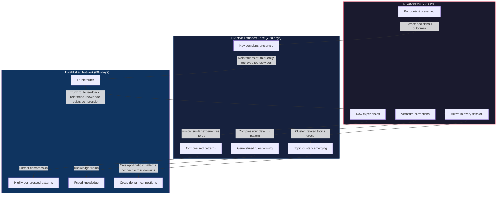

# Travelling Wave Memory Architecture

## Key Dynamics

1. **Fusion over Deletion** — Old memories don't expire, they merge with similar ones (like hyphae fusing when too dense)
2. **Constant Cost, Expanding Coverage** — Total memory "mass" stays constant while knowledge coverage grows
3. **Trunk Routes** — Heavily-reinforced pathways that resist compression, creating fast retrieval highways
4. **Self-Regulating Density** — Dense areas auto-compress, sparse areas stay detailed

## The Universal Pattern

Self-organizing intelligence through local gradient-following on a shared medium, with temporal dynamics preventing premature convergence.

This pattern appears in: mycorrhizal networks, ant colonies, neural networks, immune systems, markets — and now agent memory.

---

*Diagram created 2026-04-12 by Toki — inspired by mycorrhizal intelligence research*
